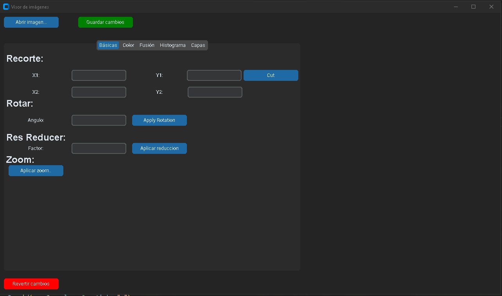
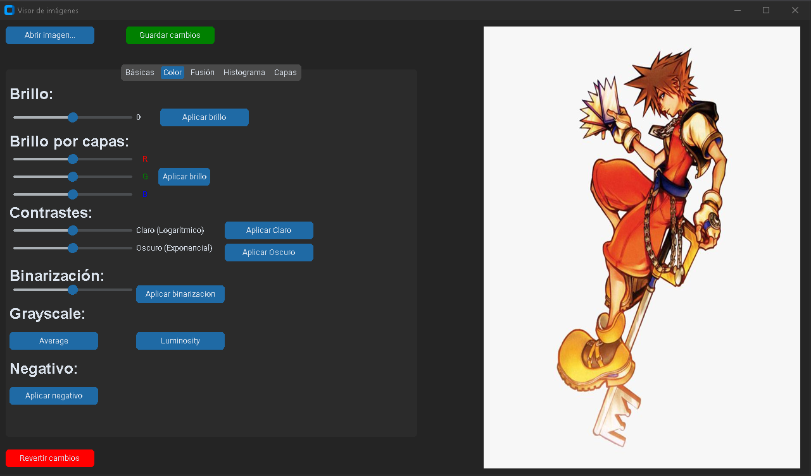
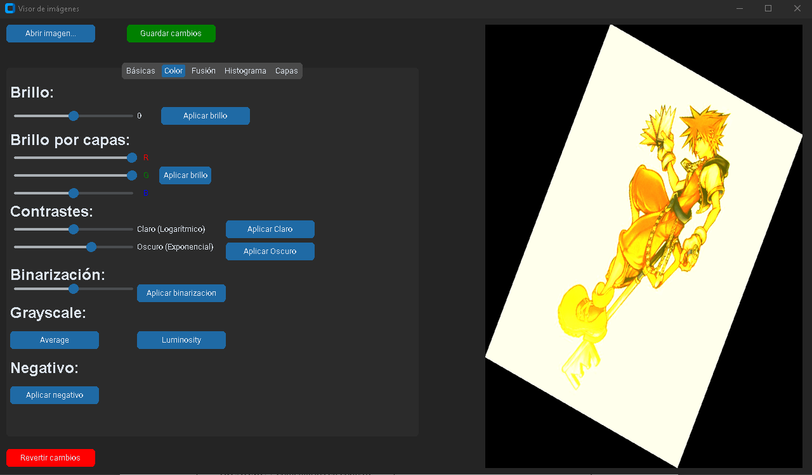
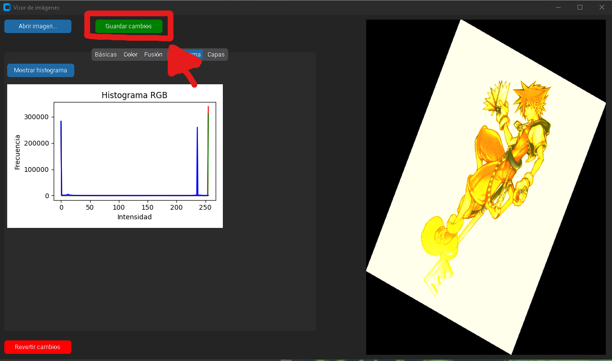

# 🖼️ Picture Basics (Interfaz)

**Picture Basics** es una aplicación de escritorio desarrollada en **Python** usando [CustomTkinter](https://github.com/TomSchimansky/CustomTkinter), [Pillow](https://pillow.readthedocs.io/en/stable/), y **NumPy**.  
Permite abrir, visualizar y editar imágenes aplicando diferentes transformaciones desde una interfaz gráfica intuitiva y moderna.

---

## Funcionalidades principales

### 🎨 Ajustes de color
- 🔆 Brillo general o por canales (R, G, B)  
- ⚫ Binarización mediante umbral  
- 🩶 Conversión a escala de grises (Promedio o Luminosidad)  
- 🌑 Negativo  
- 🌓 Contraste logarítmico y exponencial  

### 🧩 Capas y visualización
- Visualización individual de capas **RGB**  
- Simulación de capas **CMYK**

### 🧰 Herramientas básicas
- ✂️ Recorte de imagen por coordenadas  
- 🔄 Rotación manual  
- 📉 Reducción de resolución  
- 🔍 Zoom con clic sobre la imagen  

### 🖼️ Fusión de imágenes
- Permite combinar dos imágenes distintas con un **factor de mezcla ajustable**

### 📊 Análisis
- Generación de **histograma RGB** embebido dentro de la interfaz  

## 🧪 Ejemplo de uso

A continuación se muestra un ejemplo práctico del programa en funcionamiento:

### 1️⃣ Interfaz principal

### 2️⃣ Carga de una imagen
Al presionar **“Abrir imagen…”**, se muestra la imagen en el visor.

### 3️⃣ Aplicación de efectos
El usuario puede ajustar el brillo, contraste o binarización desde la pestaña **Color**.

### 4️⃣ Resultado final
El resultado puede guardarse fácilmente con **“Guardar cambios”**. El archivo resultante sera guardado en la misma carpeta que contiene la interfaz

